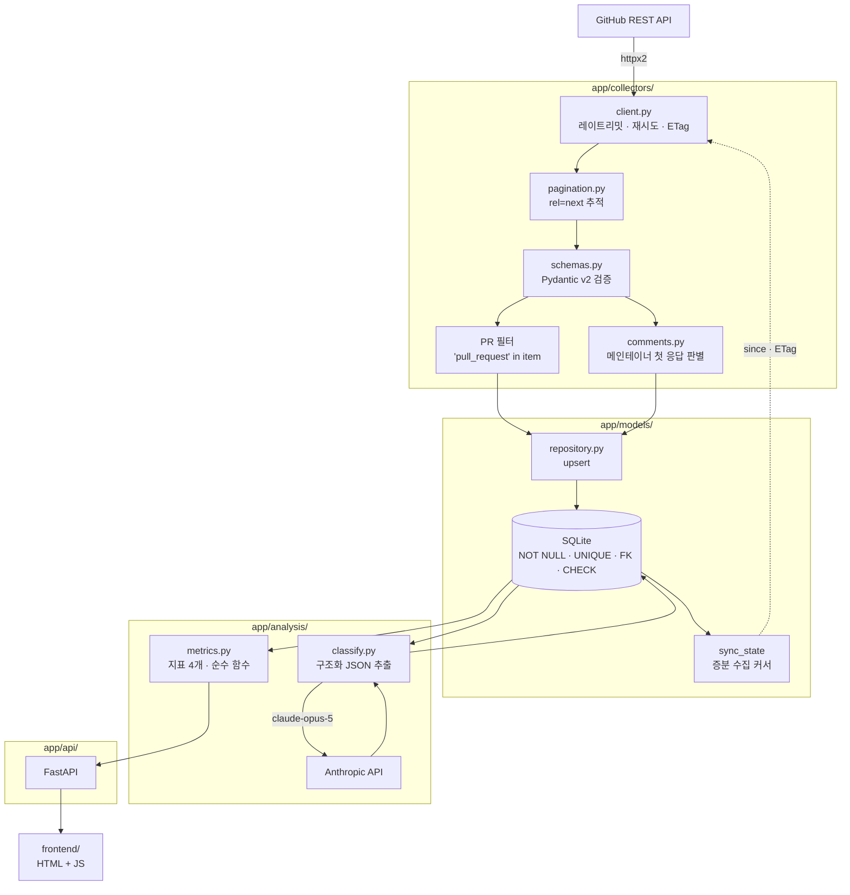

# OSS 저장소 헬스체크 대시보드

[](https://github.com/solremifa/oss-health-dashboard/actions/workflows/ci.yml)

오픈소스 저장소의 이슈를 수집·분석해 **"이 프로젝트가 지금 건강한가"** 를 정량 지표와
LLM 분석으로 보여주는 도구입니다.

분석 대상: [`PrefectHQ/fastmcp`](https://github.com/PrefectHQ/fastmcp)

> **개발 진행 중** — M2(저장 계층)까지 완료, M3(분석 계층) 진행 중입니다. [진행 상황](#진행-상황) 참고.

## 왜 만들었나

오픈소스를 쓸 때 README와 스타 수만 보고는 알 수 없는 것들이 있습니다.
이슈가 며칠 만에 답을 받는지, 올라오는 게 버그인지 기능 요청인지, 사람들이 어떤
톤으로 쓰고 있는지는 이슈 목록을 한참 읽어야 감이 옵니다.

저는 평소에 이슈와 PR을 직접 읽는 입장이라 그 과정을 반복하고 있었고, **읽어서 얻는
감각을 숫자로 바꿔보자**는 게 출발점이었습니다. 정량화되는 부분(응답 속도, 방치율)은
집계로, 자연어로만 읽히는 부분(카테고리, 감정 톤)은 LLM으로 처리합니다.

## 지표 4가지

최근 6개월 안에 **생성된** 이슈만 대상으로 합니다.

| 지표 | 정의 |
|---|---|
| **방치된 이슈 비율** | 90일 넘게 메인테이너 응답이 없는 open 이슈의 비율 |
| **버그 vs 기능요청 비율** | LLM이 분류한 카테고리(버그/기능요청/질문/기타) 분포 |
| **메인테이너 응답 속도** | 이슈 생성 → 첫 메인테이너 응답까지 걸린 시간의 중앙값 |
| **이슈 감정 톤 분포** | LLM이 판정한 톤(긍정/중립/불만) 비율 |

종합 점수를 하나로 합산하지 않습니다. 가중치를 정하는 순간 근거 없는 숫자가 되고,
4개를 따로 보는 편이 실제로 더 많은 걸 알려줍니다.

두 가지를 숨기지 않고 함께 표시합니다:

- **메인테이너 응답이 끝내 없었던 이슈 수** — 중앙값 계산에서는 빼지만 0으로 채우지
  않고 건수를 그대로 보여줍니다. 결측이 아니라 의미 있는 값입니다.
- **아직 분석되지 않은 이슈 수** — 분모에서 조용히 빼지 않습니다.

## 아키텍처



의존 방향은 한 방향입니다. `models/`가 최하단이고 다른 레이어를 import하지 않습니다.

### 설계에서 중요한 지점

**수집 축과 집계 축이 다릅니다.** GitHub API의 `since` 파라미터는 `created_at`이 아니라
**`updated_at` 기준**입니다. `since=2026-02-24`로 요청해도 2024년에 생성된 이슈가
딸려옵니다(오래전에 열렸지만 최근에 코멘트가 달린 이슈).

그래서 두 시각의 역할을 분리했습니다:

| 축 | 필드 | 역할 |
|---|---|---|
| 수집 | `updated_at` | **무엇을 가져올지** — 마지막 수집 이후 변경분만 |
| 집계 | `created_at` | **무엇을 셀지** — 최근 6개월에 생성된 이슈만 |

`since`로 넓게 받아 저장하고, 지표를 계산할 때 `created_at`으로 다시 거릅니다. 둘을
하나로 합치려 하면 증분 수집이 깨지거나 지표가 틀립니다.

**이슈만 저장하고 PR은 버립니다.** GitHub의 `/issues` 엔드포인트는 PR도 함께
반환합니다(실측: 한 페이지 100건 중 55건이 PR). 지표 4개가 전부 이슈 기반이라
PR은 수집 시점에 걸러냅니다.

**"첫 코멘트까지의 시간"은 응답 속도가 아닙니다.** 실측한 이슈 10건에서 첫 코멘트의
절반이 봇이었습니다. 그대로 재면 응답 속도가 실제보다 극적으로 빨라집니다. 그런데
**`author_association`만으로는 봇을 거를 수 없습니다** — 그 봇들의 association이 전부
`CONTRIBUTOR`였기 때문입니다. 사람이지만 저장소와 관계없는 제3자(`NONE`)도 있었습니다.

그래서 메인테이너 첫 응답은 세 조건을 모두 만족해야 합니다: `user.type == "User"`(봇 제외),
`author_association in {OWNER, MEMBER, COLLABORATOR}`(제3자 제외), 작성자 본인이 아닐 것
(self-reply 제외). 하나라도 빠지면 지표가 조용히 틀립니다.

**LLM 분류는 허용 값을 한 곳에서만 정의합니다.** 카테고리와 톤의 허용 목록은 Python
enum 하나가 단일 출처이고, 프롬프트에 적히는 선택지·Anthropic 구조화 출력의 JSON
스키마·응답 검증·DB의 CHECK 제약이 전부 거기서 파생됩니다. 한 곳만 손으로 고치면
나머지와 어긋나는데, 그 어긋남은 "모델이 이상한 값을 냈다"처럼 보입니다.

분류에 실패한 이슈는 **미분석으로 남깁니다.** `기타`로 채워 성공한 것처럼 만들지
않습니다 — 분포가 조용히 왜곡되고, 왜곡됐다는 사실이 어디에도 남지 않습니다.

이런 식으로 **코드를 쓰기 전에 API를 직접 호출해서 확인한 함정 6가지**를
[`docs/findings.md`](docs/findings.md)에 정리했습니다.

## 기술 스택

| 항목 | 선택 |
|---|---|
| 언어 | Python 3.12 |
| HTTP 클라이언트 | `httpx2` (GitHub REST API 직접 호출) |
| 웹 프레임워크 | FastAPI |
| 검증 | Pydantic v2 + pydantic-settings |
| ORM / 마이그레이션 | SQLAlchemy 2.x + Alembic |
| DB | SQLite |
| LLM | Anthropic API (`claude-opus-5`), 구조화 출력 |
| 프론트엔드 | 순수 HTML/JS/CSS (차트 라이브러리 없음) |
| 린트·포맷 / 테스트 / CI | ruff / pytest / GitHub Actions |

**PyGithub 대신 `httpx2`로 직접 호출합니다.** 이 프로젝트에서 핵심인 커서 페이지네이션,
ETag 조건부 요청, 레이트리밋 백오프를 PyGithub은 내부에 감춥니다. 직접 다뤄야 설계를
설명할 수 있고, `httpx2.MockTransport`로 429·5xx·깨진 JSON을 주입한 실패 경로 테스트가
쉽습니다.

## 실행 방법

### 1. 준비물

- Python 3.12+
- **GitHub PAT** — 미인증 레이트리밋은 60 req/시간이라 수집이 불가능합니다.
  Fine-grained token에 `Public repositories` 읽기 권한만 있으면 충분합니다.
- **Anthropic API 키**

### 2. 설치

```bash
git clone https://github.com/solremifa/oss-health-dashboard.git
cd oss-health-dashboard
python -m venv .venv
```

```bash
.venv/Scripts/python.exe -m pip install -e ".[dev]"   # Windows
```

```bash
.venv/bin/python -m pip install -e ".[dev]"           # macOS / Linux
```

### 3. 환경변수

```bash
cp .env.example .env
```

`.env`를 열어 `GITHUB_TOKEN`과 `ANTHROPIC_API_KEY`를 채웁니다.
`.env`는 `.gitignore`에 등록되어 있어 커밋되지 않습니다.

### 4. 린트 · 테스트

```bash
.venv/Scripts/python.exe -m ruff check .
```

```bash
.venv/Scripts/python.exe -m pytest
```

### 5. 개발 서버

```bash
.venv/Scripts/python.exe -m alembic upgrade head
```

```bash
.venv/Scripts/python.exe -m uvicorn app.api.main:app --reload --port 8000
```

| 엔드포인트 | 응답 |
|---|---|
| `GET /api/repos/{owner}/{repo}/metrics` | 지표 4개 |
| `GET /docs` | 대화형 API 문서 |

수집 전에는 `200 + status="pending"`, 이 대시보드가 다루지 않는 저장소는 `404`로
답합니다. **"아직 준비 안 됨"과 "존재하지 않음"을 뭉개지 않습니다.**

> 수집·분석 실행 명령은 해당 기능이 구현된 뒤에 추가합니다.
> 검증하지 않은 명령은 이 문서에 적지 않습니다.

## 데모

<!-- M4(대시보드) 완료 후 스크린샷/GIF를 여기에 추가합니다. -->

_대시보드 구현 후 스크린샷과 GIF가 들어갈 자리입니다._

## 진행 상황

| 마일스톤 | 내용 | 상태 |
|---|---|---|
| 0단계 | GitHub API 사전 조사 ([findings.md](docs/findings.md)) | 완료 |
| M0 | 프로젝트 기반 · CI | 완료 |
| M1 | 수집 계층 (클라이언트 · 페이지네이션 · 검증) | 완료 |
| M2 | 저장 계층 (모델 · 마이그레이션 · 증분 수집 · 첫 응답 판별) | 완료 |
| M3 | 분석 계층 (LLM 분류 · 지표 계산) | 완료 |
| M4 | API · 대시보드 | 진행 중 (API 완료) |
| M5 | 문서 마무리 | 예정 |

## 향후 계획

분석 결과를 Slack/Discord로 알리는 **MCP 서버** 연동을 검토 중입니다. 핵심 파이프라인이
완결된 뒤에 착수합니다.

## 문서

- [`docs/findings.md`](docs/findings.md) — 0단계 GitHub API 사전 조사 기록 (함정 6가지)
- [`CLAUDE.md`](CLAUDE.md) — 작업 규약 (레이어 규칙, DB 제약, 커밋 컨벤션)

## 라이선스

MIT
